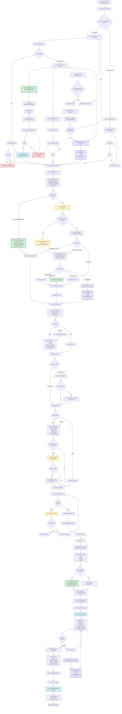

```mermaid
flowchart TD
    Start([User Accesses Meta Business Settings]) --> Login[Enter Email & Password]
    Login --> TwoFA{Two-Factor Authentication Method}
    
    %% SMS Path
    TwoFA -->|SMS Default| SendSMS[Send SMS to +81 90-****-5678]
    SendSMS --> Timer30[Start 30 Second Timer]
    Timer30 --> CodeReceived{Code Received?}
    
    CodeReceived -->|Yes| InputSMS[Input 6-digit Code]
    InputSMS --> ValidateSMS{Valid Code?}
    ValidateSMS -->|Yes| BusinessSelect[Select Business Portfolio]
    ValidateSMS -->|No| InvalidCode[Show Error: Invalid Code]
    InvalidCode --> InputSMS
    
    %% SMS Troubleshooting
    CodeReceived -->|No - After 30 sec| Troubleshoot[Show Troubleshooting Options]
    
    Troubleshoot --> AuthAppRec[★ RECOMMENDED: Download Authenticator App]
    Troubleshoot --> EmailAlt[Alternative: Receive via Email]
    Troubleshoot --> SMSTrouble[Alternative: SMS Troubleshooting]
    Troubleshoot --> ContactSupport1[Alternative: Contact Support]
    
    %% Authenticator App Setup Path - RECOMMENDED
    AuthAppRec --> ChooseApp[Choose App:<br/>Google/Microsoft/Authy]
    ChooseApp --> DownloadApp[Download App<br/>1 minute]
    DownloadApp --> ScanQR[Scan QR Code<br/>or Enter Manual Code]
    ScanQR --> InputAuthCode[Enter 6-digit Code from App]
    InputAuthCode --> ValidateAuth{Valid?}
    ValidateAuth -->|Yes| AuthSuccess[✅ Setup Complete!<br/>Save Backup Codes]
    AuthSuccess --> BusinessSelect
    ValidateAuth -->|No| AuthError[Check Time Settings<br/>Try Again]
    AuthError --> InputAuthCode
    
    %% Email Alternative
    EmailAlt --> SendEmail[Send Code to Email]
    SendEmail --> InputEmailCode[Input Code from Email]
    InputEmailCode --> ValidateEmail{Valid?}
    ValidateEmail -->|Yes| BusinessSelect
    ValidateEmail -->|No| InputEmailCode
    
    %% SMS Troubleshooting Path
    SMSTrouble --> CheckPhone{Phone Number Correct?<br/>+81 90-****-5678}
    CheckPhone -->|No| ChangePhone[Change Phone Number]
    ChangePhone --> SendSMS
    CheckPhone -->|Yes| Wait[Wait 1-2 Minutes]
    Wait --> CheckSpam[Check Spam/Blocked Messages]
    CheckSpam --> CheckCarrier[Check Carrier Settings<br/>docomo/au/SoftBank]
    CheckCarrier --> ResendSMS{Resend SMS?<br/>Max 2 attempts}
    ResendSMS -->|Yes| SendSMS
    ResendSMS -->|No| ContactSupport1
    
    %% Existing Authenticator App Path
    TwoFA -->|Authenticator App| OpenAuthApp[Open Authenticator App]
    OpenAuthApp --> ShowCode[Display 6-digit Code<br/>30 sec timer]
    ShowCode --> InputAuth2[Input Code]
    InputAuth2 --> ValidateAuth2{Valid?}
    ValidateAuth2 -->|Yes| BusinessSelect
    ValidateAuth2 -->|No| WaitRefresh[Wait for New Code]
    WaitRefresh --> ShowCode
    
    %% Business Selection
    BusinessSelect --> DisplayBusinessList[Display Business List with Details]
    DisplayBusinessList --> BusinessDetails[Show for Each Business:<br/>- Business Name & ID<br/>- Creation/Update Date<br/>- Connected Ad Accounts<br/>- Asset Summary]
    
    BusinessDetails --> HasAdAccount{Business Has<br/>Ad Account?}
    
    %% Business with Ad Account
    HasAdAccount -->|Yes ⭐ RECOMMENDED| ShowAdAccounts[Show Ad Account Details:<br/>- Account Name<br/>- Account ID act_XXXXX<br/>- Status Active/Paused<br/>- Budget & Last Used]
    ShowAdAccounts --> SelectBusiness[User Selects Business]
    SelectBusiness --> AssetVerification[Verify Required Assets]
    
    %% Business without Ad Account
    HasAdAccount -->|No ⚠️| ShowWarning[⚠️ No Ad Account Connected]
    ShowWarning --> PersonalCheck{Personal Ad Account<br/>Detected?}
    
    PersonalCheck -->|Yes| PersonalWarning[⚠️ Personal Account Found<br/>act_XXXXX<br/>Not connected to business]
    PersonalWarning --> ExplainMigration[Explain Migration Need:<br/>1. Create Business 2min<br/>2. Migrate Account 1min<br/>3. Add Assets 3min]
    ExplainMigration --> MigrationChoice{Choose Action}
    
    MigrationChoice -->|Guided Setup ⭐| GuidedSetup[Start Automated Setup]
    MigrationChoice -->|Watch Video| VideoTutorial[3min Tutorial Video]
    MigrationChoice -->|Manual Setup| ManualSetup[Manual Configuration]
    MigrationChoice -->|Contact Support| ContactSupport2[Support Chat/Phone]
    
    GuidedSetup --> CreateBusiness[Create Business Portfolio]
    VideoTutorial --> CreateBusiness
    ManualSetup --> CreateBusiness
    CreateBusiness --> MigrateAccount[Migrate Ad Account]
    MigrateAccount --> AssetVerification
    
    PersonalCheck -->|No| ProvideInfo[Show Info Modal:<br/>Why Business Portfolio?]
    ProvideInfo --> SituationChoice{User Situation}
    
    SituationChoice -->|Have Business Account| SelectBusiness
    SituationChoice -->|Personal Account User| ExplainMigration
    SituationChoice -->|Don't Know| GuidedSetup
    
    %% Asset Verification
    AssetVerification --> CheckAssets[Check Asset Status:<br/>FB Page / IG / Pixel<br/>Catalog / Email / Commerce]
    
    CheckAssets --> PixelCheck{Pixel Status?}
    
    %% Pixel Verification
    PixelCheck -->|Exists| ShowPixels[Display Pixel List:<br/>- Pixel ID<br/>- Domain<br/>- Status Active/Inactive<br/>- Last Data Received<br/>⭐ Recommended]
    ShowPixels --> SelectPixel[User Selects Pixel]
    
    PixelCheck -->|Multiple| DuplicatePixel[⚠️ Multiple Pixels Found]
    DuplicatePixel --> ShowPixels
    
    PixelCheck -->|None| CreatePixel[Create New Pixel]
    CreatePixel --> SelectPixel
    
    SelectPixel --> IGCheck{Instagram Status?}
    
    %% Instagram Verification
    IGCheck -->|Connected ✅| IGConnected[Show @handle]
    IGCheck -->|Not Connected ❌| IGConnect[Login with Instagram]
    IGConnect --> IGBizCheck{Business Account?}
    IGBizCheck -->|Yes| IGConnected
    IGBizCheck -->|No| IGConvert[Show: Convert to Business<br/>Tutorial Link]
    IGConvert --> IGConnected
    
    IGConnected --> CatalogCheck{Catalog Status?}
    
    %% Catalog Verification
    CatalogCheck -->|Exists| ShowCatalogs[Display Catalog List:<br/>- Name & Business<br/>- Product Count<br/>- Data Source<br/>- Last Updated<br/>- Active Campaigns]
    
    ShowCatalogs --> DuplicateCheck{Duplicate Products<br/>Detected?}
    DuplicateCheck -->|Yes ⚠️| ShowDuplicates[⚠️ Same products in<br/>multiple catalogs]
    ShowDuplicates --> MergeOption{Merge Catalogs?}
    MergeOption -->|Yes| MergeCatalogs[Select Master Catalog<br/>Merge Data]
    MergeOption -->|No| SelectCatalog[User Selects Catalog]
    DuplicateCheck -->|No| SelectCatalog
    
    CatalogCheck -->|Multiple| ShowCatalogs
    CatalogCheck -->|None| CreateCatalog[Create New Catalog]
    CreateCatalog --> SelectCatalog
    
    MergeCatalogs --> SelectCatalog
    SelectCatalog --> PrereqCheck[Verify All Prerequisites]
    
    %% Prerequisites Check
    PrereqCheck --> AllReady{All Assets<br/>Ready?}
    AllReady -->|No ⚠️| ShowMissing[Show Missing Items List]
    ShowMissing --> CompleteChoice{Complete Now?}
    CompleteChoice -->|Yes| GuidedCompletion[Guided Asset Setup]
    CompleteChoice -->|No| SaveDraft[Save Draft & Exit]
    GuidedCompletion --> PrereqCheck
    
    AllReady -->|Yes ✅| ShopifyIntegration[Start Shopify Integration]
    
    %% Shopify Integration
    ShopifyIntegration --> InstallMeta[Install Meta App on Shopify]
    InstallMeta --> RedirectMeta[Redirect to Meta]
    RedirectMeta --> ConfirmLogin[Confirm Login]
    ConfirmLogin --> SelectBusinessShopify[Select Business Portfolio<br/>Show Ad Account Details]
    SelectBusinessShopify --> SelectAssets[Select/Confirm Assets:<br/>- Pixel<br/>- Catalog<br/>- FB Page<br/>- IG Account]
    
    SelectAssets --> CatalogSync{Sync Products<br/>from Shopify?}
    CatalogSync -->|Yes| AutoSync[Enable Auto Sync<br/>Show Product Preview<br/>Set Sync Frequency]
    CatalogSync -->|No| ManualCatalog[Manual Catalog Management]
    
    AutoSync --> GrantPermissions[Grant Permissions:<br/>- Product Data Access<br/>- Auto Sync]
    ManualCatalog --> GrantPermissions
    
    GrantPermissions --> FinalConfirm[Final Confirmation Screen:<br/>Review All Settings]
    FinalConfirm --> ConfirmConnect[User Confirms Connection]
    ConfirmConnect --> ConnectionSuccess[✅ Shopify Connected]
    
    %% Campaign Creation
    ConnectionSuccess --> PreflightCheck[Pre-flight Check:<br/>✅ Business<br/>✅ Ad Account<br/>✅ Pixel Active<br/>✅ Catalog Synced<br/>✅ Shopify Connected<br/>✅ Payment Method]
    
    PreflightCheck --> AllGreen{All Checks<br/>Passed?}
    AllGreen -->|No ❌| FixIssues[Show Issues to Fix]
    FixIssues --> ContactSupport3[Contact Support if Needed]
    FixIssues --> PreflightCheck
    
    AllGreen -->|Yes ✅| CreateCampaign[Create Advantage+ Campaign]
    CreateCampaign --> CampaignSetup[Campaign Setup:<br/>- Name<br/>- Objective Sales<br/>- Budget & Schedule<br/>- Select Catalog<br/>- Audience Auto/Custom]
    
    CampaignSetup --> ReviewCampaign[Review Campaign Settings]
    ReviewCampaign --> LaunchCampaign[Launch Campaign]
    LaunchCampaign --> Success[🎉 Campaign Successfully Created]
    
    Success --> Dashboard[Show Campaign Dashboard<br/>& Optimization Tips]
    Dashboard --> End([End - Campaign Active])
    
    %% Support Points
    ContactSupport1 --> SupportHub1[Support Options:<br/>💬 Chat<br/>📞 Phone<br/>📺 Video Tutorials<br/>📄 FAQ]
    ContactSupport2 --> SupportHub2[Support Options:<br/>💬 Chat<br/>📞 Phone<br/>📺 Video Tutorials<br/>📄 FAQ]
    ContactSupport3 --> SupportHub3[Support Options:<br/>💬 Chat<br/>📞 Phone<br/>📺 Video Tutorials<br/>📄 FAQ]
    
    SupportHub1 --> BusinessSelect
    SupportHub2 --> AssetVerification
    SupportHub3 --> PreflightCheck
    
    %% Styling
    classDef recommended fill:#d4edda,stroke:#28a745,stroke-width:3px
    classDef warning fill:#fff3cd,stroke:#ffc107,stroke-width:2px
    classDef error fill:#f8d7da,stroke:#dc3545,stroke-width:2px
    classDef success fill:#d1ecf1,stroke:#17a2b8,stroke-width:2px
    classDef support fill:#e7e3fc,stroke:#6f42c1,stroke-width:2px
    
    class AuthAppRec,ShowAdAccounts,GuidedSetup,AutoSync recommended
    class ShowWarning,PersonalWarning,ShowDuplicates,ShowMissing warning
    class InvalidCode,AuthError error
    class AuthSuccess,ConnectionSuccess,Success success
    class ContactSupport1,ContactSupport2,ContactSupport3,SupportHub1,SupportHub2,SupportHub3 support
```
